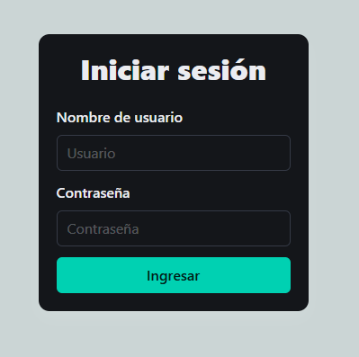
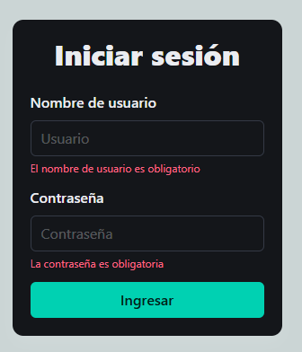
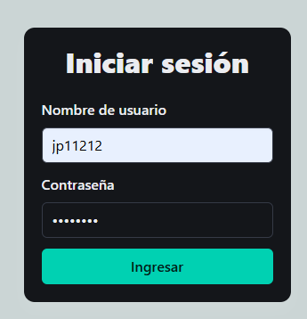
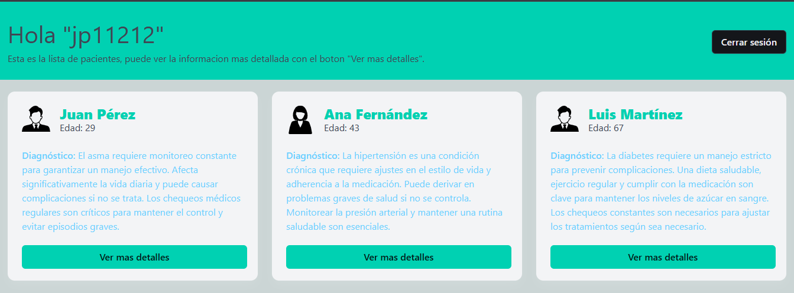
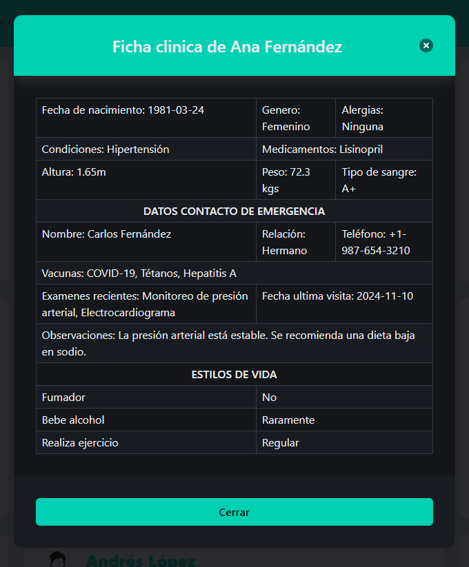

# Patient Card

##### El objetivo de esta aplicación es construir una landing con una serie de tarjetas de paciente en donde se muestran los datos básicos como el nombre, la edad, diagnostico principal y un botón el cual lanza una modal de detalles con mas información sobre la persona.

#

## Caracteristicas

##### La aplicación esta realizada con ReactJS, principalmente cuenta con 2 vistas las cuales son el login y el home. en el login, se muestra un formulario con 2 campos (usuario y contraseña). se puede poner cualquier usuario y contraseña siempre y cuando la contraseña contenga mas de 6 caracteres y que tanto usuario y contraseña sean enviados. de lo contrario no se podra acceder.

##### Una vez se verifica la información del login, se accede a la home de la aplicacion en donde hay 9 tarjetas con los datos solicitados mas el botón que muestra la modal con información detallada

#### Por ultimo, en el header se muestra el nombre del usuario logeado y un botón para cerrar la sesión y enviar al login nuevamente

#

## Screenshots







## Tecnologias usadas

- ReactJS
- Bulma CSS
- Github
- Formik
- TypeScript
- Yup
- React Router

## Instalación

Verificar que se tenga Nodejs instalado o en una version superior a la 16 (v22.4.1) para la ejecucion de los comandos, tambien verificar que se tenga yarn instalado

```
- node -v ===> verificar version de node
- yarn -v ===> verificar yarn en el pc
```

Una vez descargado el repositorio, se puede ver el proyecto con un editor como VS Code o sublime, tambien, se puede abrir directamente desde una terminal para ejecutar los comandos

```sh
- cd patient-card
- yarn
- npm run dev
```

De esa forma, en la terminal, generara una url parecida a esta http://localhost:5173/ en donde se puede ver la app en un entorno local y de desarrollo
